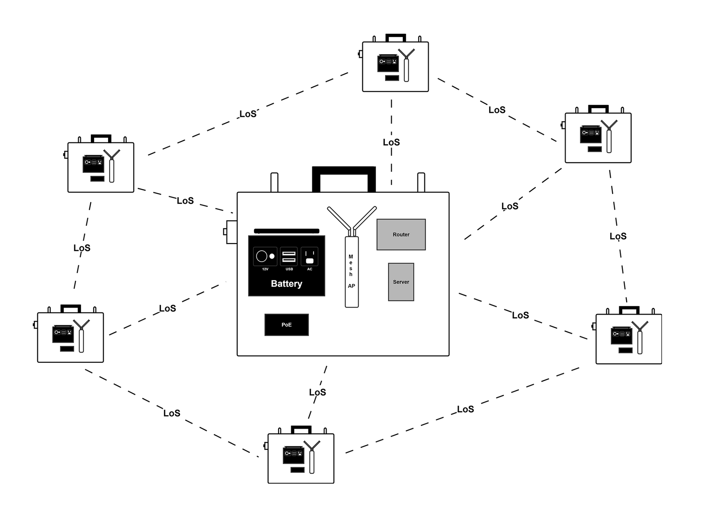
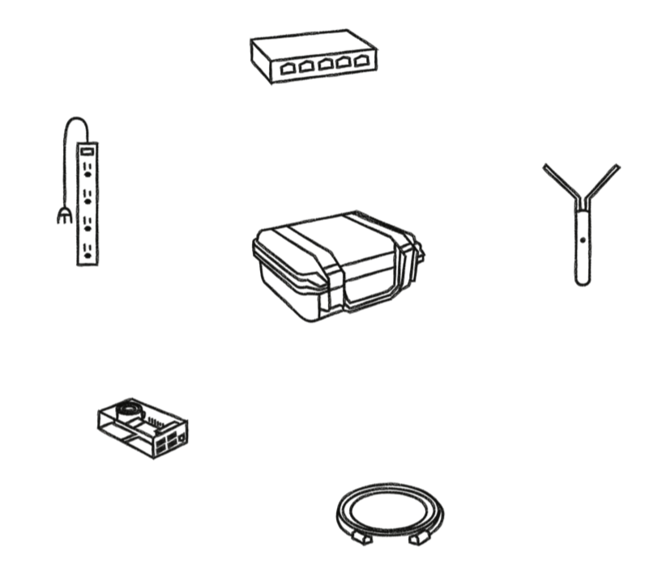
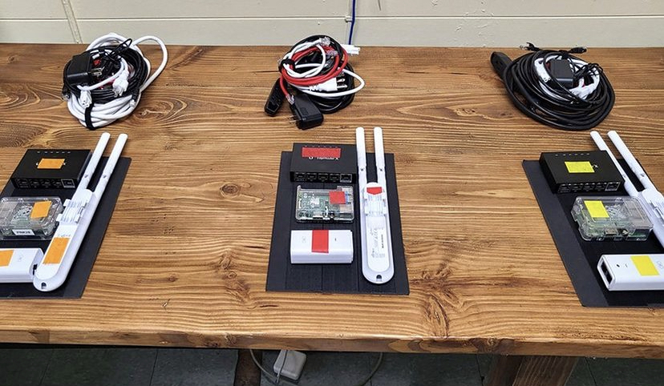
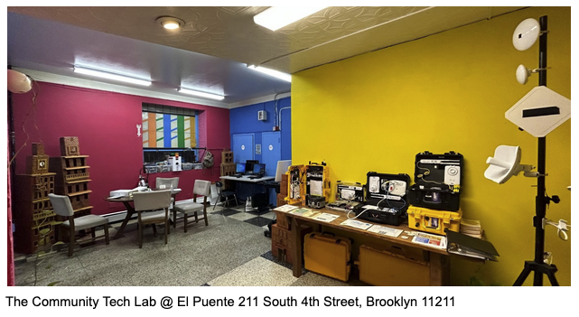

# **About The Portable Network Kit**

The **Portable Network Kit (PNK)** is a wireless network in a suitcase that helps people understand how to build their own mini-internet – and with it, how the internet works and might be owned and governed more equitably. Originally conceived as a network repair kit for [Resilient Networks for RISE: NYC](https://www.newamerica.org/resilient-communities/flexible-future-ready-networks/rise-nyc/) in New York City, the kits were repurposed to work both as a teaching tool and as an emergency standalone wireless network. 

## **History & Partners**

PNK was originally developed in 2017 by [Community Tech NY](https://www.communitytechny.org/) through the Resilient Networks NYC project, a 5-neighborhood NYC mesh networking partnership among [New America’s Resilient Communities program](https://www.newamerica.org/resilient-communities/), [The Point CDC](https://www.thepoint.org/), [the Fifth Avenue Committee](https://hcr.ny.gov/location/fifth-avenue-committee-inc), the Kings Bay Y, [Silicon Harlem](https://siliconharlem.com/), and the [Rockaway Development and Revitalization Corporation](https://www.rdrc.org/). Resilient Networks NYC was supported by the New York City Economic Development Corporation’s RISE:NYC program, a Superstorm Sandy recovery effort. 

Currently, it is being expanded and maintained by the Community Tech Lab, a partnership between Community Tech NY and [El Puente de Williamsburg](https://www.elpuente.org/), and supported by [The Altman Foundation](https://www.altmanfoundation.org/) and [the New York Community Trust (NYCT)](https://thenytrust.org/).

This server documentation and software are free and open source, made possible by funding from the [Internet Society Foundation (ISOC)](https://www.internetsociety.org/).

## **What Is A PNK?**

**PNKs** consist of off-the-shelf hardware and open-source software housed in a waterproof, battery-powered, solar-enabled kit. The kits can be used to connect to an existing internet connection or offline as a local wireless networking system, complete with its own server, chat service, and document editor. 

### **Hardware**

 Illustration of PNK Components by TBA 

The off-the-shelf elements of the PNK include a processor, a wireless modem/router, and a wireless antenna, providing a modular, accessible and customizable starting off point.

| Component  | Role | Part Number | Links | 
| ------------- | ------------- | ------------- | ------------- |
| **Raspberry Pi 5**  | _Processor_ | RP5-8GB | [RaspberryPi](https://www.raspberrypi.com/products/raspberry-pi-5/) or [Vilros](https://vilros.com/collections/raspberry-pi-5/products/raspberry-pi-5?variant=40082990399582)  |
| **SD Card**  | _Local Storage_| MB-MC64GA/AM  | [Samsung Evo](https://www.samsung.com/us/computing/memory-storage/memory-cards/evo-plus-microsdxc-memory-card-64gb-mb-mc64ha-am/)  |
| **MikroTik Router**  | _Wireless Router_ | RB960PGS  | [Mikrotik](https://mikrotik.com/product/RB960PGS) or [Newegg](https://www.newegg.com/p/0XK-000J-00040)  |  
| **AC Mesh**  | _Wireless Antenna_ | UAP-AC-M  | [Ubiquity](https://store.ui.com/us/en/collections/unifi-wifi-outdoor-long-range/products/uap-ac-mesh) | 
| **Ethernet Cables** | _Connector_ | | |

For **a spreadsheet B.O.M.** [click here](https://docs.google.com/spreadsheets/d/1eakXmEV1p509UbTNdT2-7seFS0PiE2jJiWioWvAZDfM/edit?gid=0#gid=0). 

### **Software**
The open-source software of the PNK establishes a local wireless networking system, featuring its own shared server, chat service, and document editor. It provides access to self-contained and self-maintained communication and collaboration tools.

**For code, software documentation and license**, [click here](https://github.com/Community-Tech-Lab/PNK-Software). 

**PNKs are NOT a product** – _[Community Tech NY](https://www.communitytechny.org/) does not sell them off-the-shelf. [CTNY](https://www.communitytechny.org/) uses PNKs when training community members in network development and deployment, giving them practical hands-on experience that can serve as a springboard for building their own networks with in-person or remote learning support._

**The PNK project was developed with a strong commitment to community collaboration and shared progress. We encourage you to use and contribute to it in a spirit of collective improvement and mutual benefit, ensuring that it serves the greater good and fosters positive innovation.**

If you're interested in a training or workshop with the PNK, please **[get in touch](https://docs.google.com/forms/d/e/1FAIpQLSeaSGgodyQXhLplaR_w3bcliHZtsk8GAK5E5mqxCkI6_oVRzw/viewform?usp=sf_link)**.

## **Disclaimer of Warranties and Limitation of Liability**

Unless otherwise separately undertaken by Community Tech NY (CTNY) to the extent possible, CTNY offers the Portable Network Kit (PNK) materials as-is and as-available, and makes no representations or warranties of any kind concerning these licensed materials, whether express, implied, statutory, or other. This includes, without limitation, warranties of title, merchantability, fitness for a particular purpose, non-infringement, absence of latent or other defects, accuracy, or the presence or absence of errors, whether or not known or discoverable. Where disclaimers of warranties are not allowed in full or in part, this disclaimer may not apply to You.

To the extent possible, in no event will CTNY be liable to You on any legal theory (including, without limitation, negligence) or otherwise for any direct, special, indirect, incidental, consequential, punitive, exemplary, or other losses, costs, expenses, or damages arising out of this Public License or use of the Licensed Materials, even if CTNY has been advised of the possibility of such losses, costs, expenses, or damages. Where a limitation of liability is not allowed in full or in part, this limitation may not apply to You.

## **License**

The ***Portable Network Kit (PNK)*** by [Community Tech NY](https://www.communitytechny.org/) is licensed under [Creative Commons Attribution-NonCommercial-ShareAlike 4.0 International](https://creativecommons.org/licenses/by-nc-sa/4.0/). To view a copy of this license, visit [https://creativecommons.org/licenses/by-nc-sa/4.0/](https://creativecommons.org/licenses/by-nc-sa/4.0/).

